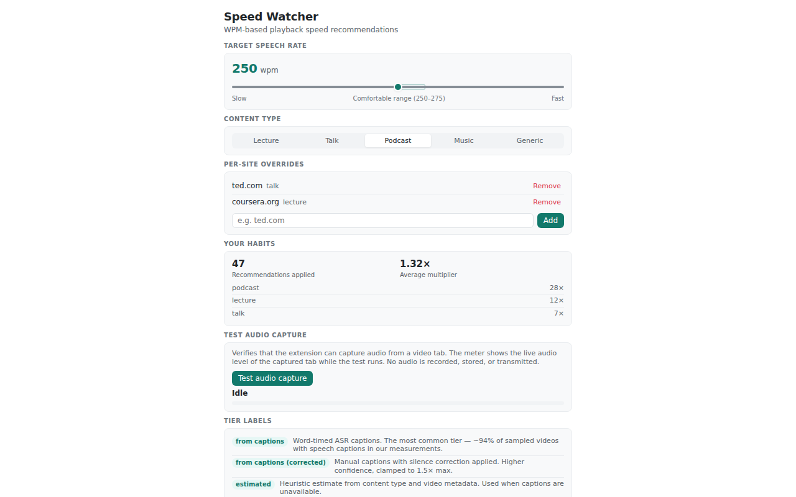

# Speed Watcher

Recommends the playback speed that lands speech in the 250–275 wpm
comfortable listening range — measured from the video's own captions, not
guessed from content type.

<!-- Add the CWS install-count badge here once the store listing is live. -->

## Install

| Surface | Where | Status |
|---|---|---|
| Chrome | [Chrome Web Store](https://chrome.google.com/webstore/detail/<storeId>) | filling at launch |
| Firefox | [Firefox Add-ons](https://addons.mozilla.org/firefox/addon/speed-watcher/) | filling at launch |
| Userscript | [speed-watcher.user.js](https://github.com/levosilimo/speed-watching/releases/latest/download/speed-watcher.user.js) — for Tampermonkey/Violentmonkey, no store needed | ready |
| mpv | Clone the repo (or unpack the release source tarball), then follow the install steps in [`mpv/README.md`](mpv/README.md) | ready |

## How it works

1. Reads the word-timed captions the video already carries.
2. Computes the natural speech rate and the multiplier that hits your target.
3. Shows a pill on the video — one click applies, one click dismisses.

## The science

250–275 wpm is a commonly cited comfortable listening range, not a
comprehension guarantee. Each language's rate is measured in its own unit —
words, characters, syllables, morae:

| Language | Target | Ceiling | Basis |
|---|---|---|---|
| English | 250 wpm | 275 wpm | measured |
| Japanese | 470 morae/min | 495 morae/min | derived, corpus-anchored prior |
| Chinese | 240 cpm | 258 cpm | derived; ceiling comprehension-measured |
| Russian | 168 wpm | 180 wpm | derived, corpus-anchored prior |

22 languages — [full model and sources](docs/languages.md).

## Privacy

Everything runs locally — the extension reads captions from the page's own
context and makes no outbound requests. Full policy:
[Privacy Policy](https://levosilimo.github.io/speed-watching/privacy-policy/).

## Contributing

Bugs and feature requests go through the issue templates; PRs carry the DoD
checklist in [CONTRIBUTING.md](CONTRIBUTING.md). Free forever. If it saves
you time, [Sponsor](https://github.com/sponsors/levosilimo).

## FAQ

**"YouTube already has a speed setting."** It is a fixed multiplier — you
guess 1.5× and re-adjust. Speed Watcher shows the video's measured speech
rate and the exact multiplier that lands you in range.

**"What about YouTube Auto Speed?"** It needs Premium, runs on Android, and
handles English only, and it sets a rate without showing you the speech
rate. Speed Watcher is desktop, free, works without Premium, covers 22
languages, and slows down fast talkers instead of only ever speeding up.

## Stack

WXT 0.21, vanilla TypeScript, Chrome MV3 (min_chrome_version 116) and
Firefox 128+, bun as package manager, Vitest, oxlint, knip, Playwright
(chromium, Chrome-for-Testing, and firefox e2e lanes).

## Commands

- `bun run dev` — watch mode with HMR
- `bun run build` — production build to `.output/chrome-mv3/`
- `bun run build:firefox` — Firefox build (required before `e2e:firefox`)
- `bun run test` — vitest run
- `bun run typecheck` — `tsc --noEmit`
- `bun run lint` — oxlint
- `bun run check` — aislop prose gate (same as the pre-commit hook)
- `bun run knip` — unused code and dependency check
- `bun run ci` — the CI pipeline (`scripts/run-ci.ts`)
- `bun run e2e:chromium` / `e2e:cft` / `e2e:firefox` — Playwright suites
  against the built extension (see `docs/ci-e2e.md`)
- `bun run check:cws` — offline CWS review scan over the built bundle

## Architecture

- `entrypoints/` — WXT entrypoints: `background.ts`, `content.ts` and
  `generic.content.ts` (player detection, caption harvest), `bridge.content.ts`,
  `options/` (options page; the audio capture test ships, the STT demand-gate
  diagnostics stay dev-only in `options/dev.ts`)
- `lib/` — domain logic with no browser-surface code: caption parsing
  (`captions.ts`), wpm measurement (`wpm.ts`, `tokenizer.ts`), recommendation
  (`recommend.ts`, `heuristics.ts`), storage (`settings.ts`, `override-log.ts`,
  `demand.ts`), audio probe (`audio-probe.ts`, `capture-orchestrator.ts`)
- `ui/` — the pill (`pill.ts`, `styles.ts`) and options-page styles
- `tests/` — vitest specs for lib and ui modules
- `e2e/` — Playwright suites against the built extension; shared specs in
  `e2e/shared/specs.ts`
- `scripts/` — measurement harnesses and quality gates
- `docs/` — product, measurement, and store-submission records

## Measurement philosophy

Speed is measured per video from caption timing, not guessed from the source.
The 250–275 wpm target is a commonly cited comfortable listening range, not a
comprehension guarantee; the extension treats it as a heuristic, warns when
pause-heavy captions make the estimate uncertain, and ties every cited number
in store copy to the samples in `docs/phase0-caption-wpm.md`.

## Docs

- `docs/store-listing.md` — Chrome Web Store listing copy
- `docs/store-readiness.md` — submission checklist and bundle checks
- `docs/amo-listing.md` — Firefox AMO listing
- `docs/phase0-caption-wpm.md` — caption availability and wpm measurement
- `docs/phase0-generic-probe.md` — generic player detection
- `docs/phase0-offscreen-audio.md` — tab capture and offscreen audio probe
- `docs/demand-gate.md` — STT demand gate
- `docs/provider-integration.md` — the measured-rate provider (`wpm:get`) protocol
- `docs/core-library.md` — the chrome-free measurement core and porting notes
- `docs/manual-gates-runbook.md` — manual verification gates
- `docs/phase2-whisper-benchmark.md` — on-device STT benchmark
- `docs/ci-e2e.md` — e2e setup and lanes
